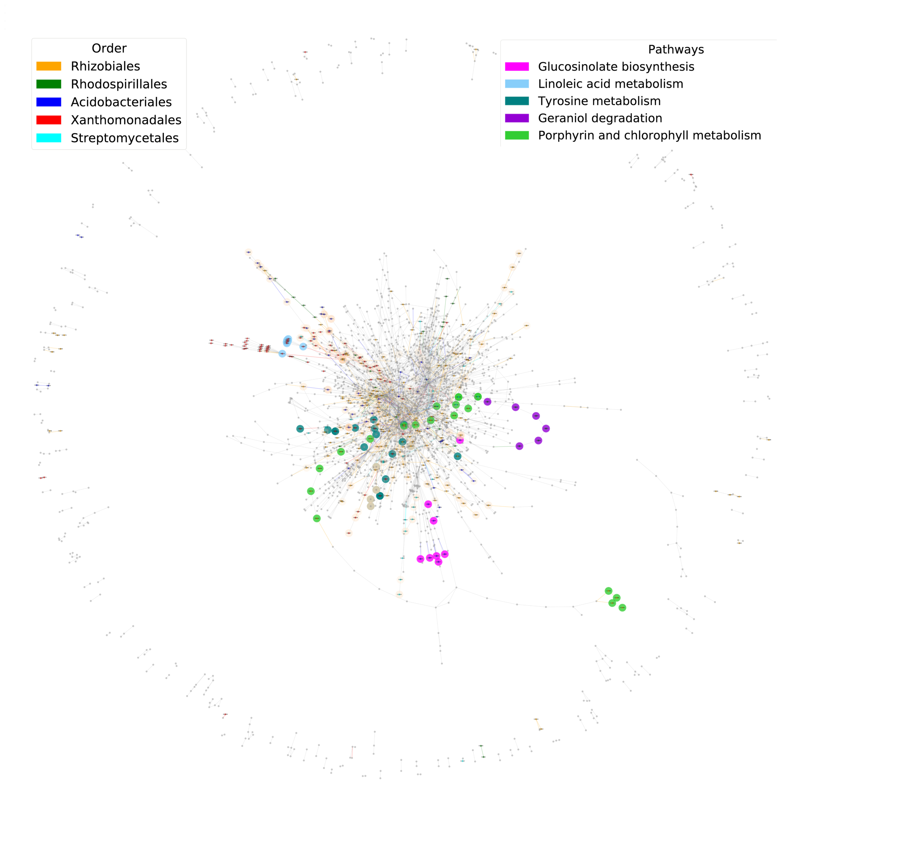

# NetCom2

A pipeline for reproducing sequence processing and analysis of metagenomics data produced for Berihu et al ("A framework for the targeted recruitment of crop-beneficial soil taxa based on network analysis of metagenomics data")

## Benchmarks

All datasets mentioned in text are available in **https://volcanicenter-my.sharepoint.com/:f:/g/personal/shmedina_volcani_agri_gov_il/EicqyHpmSmBJmwgHO0oqJ8MBcxNtvXw0KUs6hYyyQ4wvzA?e=khRLmH**.

## Dependencies

* [python (version >= 3.8)]
* [matplotlib (version 3.3.3)]
* [networkx (version 2.5)]
* [pandas (version 1.1.4)]
* [skbio (version 0.5.6)]
* [numpy (version 1.19.4)]
* [ete3 (version 3.1.2)]

## Installation
### Download and install NetCom2 on linux (Ubuntu 20.04)
### Create virtual environment and install dependencies

```shell
# Create venv #
mkdir netcom2
cd netcom2
virtualenv netcom2
source netcom2/bin/activate
```

### Download and install NetCom2 on Windows
```shell
mkdir netcom2
cd netcom2
python -m venv C:\path\netcom2
C:\path\netcom2\Scripts\Activate
```

```shell
# You may need to install svn and pip3 #
pip install svn
svn export https://github.com/ot483/NetCom2/trunk/Scripts
curl -L https://raw.githubusercontent.com/ot483/NetCom2/main/requirements.txt > requirements.txt
pip install -r requirements.txt
```


## Tutorial

### Run NetCom2

#### Get contig taxonomy

The script determines the taxonomic classification of each contig according to the annotations of its respective genes. The script takes as input a Megan output file with taxonomic annotation for each gene and determines the taxonomic annotation of the corresponding contigs according to most frequent taxonomy of the associated genes.

Input: **NTC_G210-ReadName_to_TaxonPath.txt**

```shell
python get_contig_taxonomy.py -i NTC_G210-ReadName_to_TaxonPath.txt -t temp_1 -o get_contig_taxonomy_ranked_NTC_G210.txt --get_rank
```

Output: **get_contig_taxonomy_ranked_NTC_G210.txt**

```shell
Contig	most_frequent_taxonomy	common_taxonomy	Same_taxonomy?	taxonomy_rank
k127_24108426	;root;cellular_organisms;Bacteria;Nitrospirae;Nitrospira_<class>;Nitrospirales;Nitrospiraceae;Nitrospira	;root;cellular_organisms;Bacteria;Nitrospirae;Nitrospira_<class>;Nitrospirales;Nitrospiraceae;Nitrospira	Yes	class
k127_19142040	;root;cellular_organisms;Bacteria;FCB_group;Bacteroidetes/Chlorobi_group;Bacteroidetes;Cytophagia;Cytophagales;Hymenobacteraceae	;root;cellular_organisms;Bacteria;FCB_group;Bacteroidetes/Chlorobi_group;Bacteroidetes;Cytophagia;Cytophagales;Hymenobacteraceae	Yes	family
k127_8052916	;root;cellular_organisms;Bacteria	;root;cellular_organisms;Bacteria	Yes	superkingdom
k127_20237200	;root;cellular_organisms;Bacteria	;root;cellular_organisms;Bacteria	Yes	superkingdom
k127_12695121	;root;cellular_organisms;Bacteria;Terrabacteria_group;Actinobacteria_<phylum>;Actinobacteria;Micromonosporales;Micromonosporaceae;Actinoplanes	;root;cellular_organisms;Bacteria;Terrabacteria_group;Actinobacteria_<phylum>;Actinobacteria;Micromonosporales;Micromonosporaceae;Actinoplanes	Yes	genus
k127_26869126	;root;cellular_organisms;Bacteria	;root;cellular_organisms;Bacteria	Yes	superkingdom
k127_13862072	;root;cellular_organisms;Bacteria;Proteobacteria;Alphaproteobacteria;Rhizobiales;Bradyrhizobiaceae;Bradyrhizobium	;root;cellular_organisms;Bacteria;Proteobacteria;Alphaproteobacteria;Rhizobiales;Bradyrhizobiaceae;Bradyrhizobium	Yes	genus
k127_10729228	;root;cellular_organisms;Bacteria;Terrabacteria_group	;root;cellular_organisms;Bacteria;Terrabacteria_group	Yes	no_rank
k127_19943285	;root;cellular_organisms;Bacteria	;root;cellular_organisms;Bacteria	Yes	superkingdom
...
```

#### Prepare taxonomy count table

The script merges the count table (constructed for contigs, Methods) and the taxonomic annotations of the contigs (generated in step 1) and creates a count table based on the selected taxonomic level by merging respective contigs.

Input: **get_contig_taxonomy_ranked_NTC_G210.txt**, **NTC_G210.count_tab.matrix**

```shell
python prepare _taxonomy_count_table.py -o count_table_taxonomy_NTC_G210.contig.genus.txt -c NTC_G210.count_tab.matrix -t get_contig_taxonomy_ranked_NTC_G210.txt -l genus
```
-l : specifying taxonomic rank according to ncbi taxonomy etc species,genus,order,phylum

Output: **count_table_taxonomy_NTC_G210.contig.genus.txt**

```shell
	NTC_G210_1	NTC_G210_2	NTC_G210_3	NTC_G210_4	NTC_G210_5
Kosakonia	10	3.9	1.7	1.7	1.8	
Reinekea	41.9	52.8	48.7	49.2	81.8	
Ochrobactrum	66.7	72.9	79.4	58.4	96.2	
Actinopolyspora	111.1	102.3	80.3	69.8	87.4	
Unidentified_Chroococcales	33.9	96.6	81.8	68.3	90.6	
Ustilago	2	3.5	2.8	2	1.7	
Chloroflexus	1111.6	1261.1	1250.5	1056.5	1365.5	
Methanolacinia	14.7	20.7	24.6	15.8	20.9	
Cp51virus	1.5	2.1	3.4	2.3	2.7	
Thiolinea	37.3	58.8	58.1	61.3	85.4	
Mycolicibacter	13.1	16.2	18.9	14.6	25.7	
Gigaspora	7.4	11.6	12.3	5.8	3.7	
Demequina	55.2	59.1	59.4	45.8	74.8	
Yuavirus	3.3	4.5	7.1	1.8	1.2	
Gonium	7.4	6.5	6	6.6	21.2	
Fortiea	36.5	51	47.2	39.2	76.9	
...
```

#### Filter enzymatic functions

The script takes as input a Megan output file with KEGG functional annotations and filters only entities with EC/KEGGs KO identifiers.

Input: **NTC_G210-ReadName_to_KeggName_Ultimate.txt**

```shell
Perl Filter_enzymatic_functions.pl
Change parameters: my $file ="NTC_G210-ReadName_to_KeggName_Ultimate"
open IN ,$file
open (OUT,">protein_EC_codes_total_NTC_G210.txt")
```

Output: **protein_EC_codes_total_NTC_G210.txt**

```shell
k127_5121010_270	1.1.1.1
k127_10112354_97	1.1.1.1
k127_7896669_137	1.1.1.1
k127_1162434_42	1.1.1.1
k127_6366961_84	1.1.1.1
k127_1164994_43	1.1.1.1
k127_23402251_87	1.1.1.1
k127_19133019_43	1.1.1.1
k127_4002997_33	1.1.1.1
k127_25639875_4	1.1.1.1
k127_14110403_48	1.1.1.1
k127_1494996_15	1.1.1.1
k127_3628809_52	1.1.1.1
...
```

#### Prepare function count table

The script merges the count table with functional annotations retrieved from MEGAN and filtered in Step 3, creating a count table based on the functional keys (EC/KEGGs KO).

Input: **protein_EC_codes_total_NTC_G210.txt**, **NTC_G210.count_tab.matrix**, **NTC_G210-ReadName_to_TaxonPath.txt**

```shell
python prepare_function_count_table.py -d protein_EC_codes_total_NTC_G210.txt -t temp_1 -o count_table_function NTC_G210.contig.txt -c NTC_G210.count_tab.matrix -p NTC_G210-ReadName_to_TaxonPath.txt
```

Output: **count_table_function_NTC_G210.contig.txt**

```shell
NTC_G210_1	NTC_G210_2	NTC_G210_3	NTC_G210_4	NTC_G210_5
3.4.11.1	240.49999999999997	302.0	285.4000000000001	214.6	303.5
2.6.1.21	99.39999999999999	122.19999999999999	98.8	80.89999999999999	112.10000000000001
4.2.1.57	10.8	14.899999999999999	12.5	13.5	16.6
5.3.1.-	25.6	47.6	48.9	34.1	47.7
3.6.3.8	87.2	106.39999999999998	107.70000000000002	75.8	113.80000000000001
6.3.4.18	110.7	139.7	124.10000000000001	99.0	160.60000000000002
2.4.1.14	0.0	0.0	0.0	0.0	0.0
1.1.1.163	0.0	0.0	0.0	0.0	0.0
3.4.21.7	0.0	0.0	0.0	0.0	0.0
1.1.1.262	105.3	109.89999999999999	123.99999999999999	81.7	112.29999999999998
4.1.1.71	0.0	0.0	0.0	0.0	0.0
3.3.2.8	6.1	3.6	4.9	4.3	4.7
2.3.1.29	137.5	159.20000000000005	168.70000000000002	141.49999999999997	195.50000000000003
5.3.1.12	34.8	44.800000000000004	44.29999999999999	32.4	67.7
1.13.11.66	0.0	0.0	0.0	0.0	0.0
2.7.1.170	81.50000000000001	94.1	93.4	59.5	96.0
...
```

#### Prepare function taxonomy count table contigwise

The script merges the count table according to a taxonomic (Step 2) and functional (Step 4) keys into a double-key (taxonomic/functional) count table. The output file details the taxonomic distribution of reads assigned to each enzymes at a selected taxonomic level.

Input: **protein_EC_codes_total_NTC_G210.txt**, **NTC_G210.count_tab.matrix**, **NTC_G210-ReadName_to_TaxonPath.txt**, **get_contig_taxonomy_NTC_G210.txt**

```shell
python prepare_function_taxonomy_ctable_contigwise.py -d protein_EC_codes_total_NTC_G210.txt -r temp_1 –o function_taxonomy _countable_NTC_G210.contig.genus.txt -c NTC_G210.count_tab.matrix -p NTC_G210-ReadName_to_TaxonPath.txt -t get_contig_taxonomy_NTC_G210.txt -l genus
```
-l : specifying taxonomic rank according to ncbi taxonomy etc species,genus,order,phylum

Output: **function_taxonomy_countable_NTC_G210.contig.genus.txt**

```shell
EC	taxa	NTC_G210_1	NTC_G210_2	NTC_G210_3	NTC_G210_4	NTC_G210_5
1.1.1.1	Unidentified	107.6	148.89999999999998	127.8	103.19999999999999	130.49999999999997
1.1.1.1	Ilumatobacter	4.0	20.0	12.0	9.9	16.0
1.1.1.1	Unidentified_Verrucomicrobiales	3.7	9.2	7.1	4.8	2.4
1.1.1.1	Conexibacter	2.9	5.2	4.1	3.5	6.2
1.1.1.1	Unidentified_Geodermatophilales	6.3	6.6	6.0	4.5	5.4
1.1.1.1	Unidentified_Sphingomonadales	19.2	21.7	18.4	15.2	22.0
1.1.1.1	Candidatus_Entotheonella	4.3	5.2	7.5	6.6	7.7
1.1.1.1	Gaiella	2.4	2.3	1.5	3.3	3.1
...
```

#### Calculate enzyme diversity score

The script takes as input the enzyme – diversity table generated at Step 5 and calculates a diversity score for each enzyme, indicating whether it is dominantly present in a specific taxonomic group (at a selected taxonomic level) or widely distributed across microbial community.

Input: **function_taxonomy_countable_BjSa_NTC.contig.genus.txt**

```shell
python calculate_enzyme_diveristy_score.py function_taxonomy_countable_BjSa_NTC.contig.genus.txt /path/to/input/file/
```

Output: **ECs_with_dominant_taxon.txt**, **ECs_with_dominant_taxon_knockout.txt**, **RscriptOutput.csv**, **RscriptOutput_filter_IdentMostFreq.csv**, **RscriptOutput_filter_IdentMostFreqbyEnzyme.csv**, **RscriptOutput_filter_dominance.csv**


```shell
ECs_with_dominant_taxon.txt
all 1.13.11.73 2.4.1.83 1.5.-.- 3.3.2.1 3.5.1.84 3.5.3.13 3.5.1.98 3.1.2.12 1.1.1.47 3.1.7.2 1.6.3.- 2.4.1.14 1.8.7.1 2.4.1.18 2.1.3.11 1.6.5.4 1.2.98.1 4.2.1.149 1.1.1.401 2.7.1.- 1.1.99.28 3.1.30.1 3.1.3.78 3.5.1.6 3.5.3.15 3.2.1.52 1.7.2.5 2.1.1.98 3.1.1.5 2.7.9.3 3.5.99.10 1.14.11.8 5.4.99.24 6.3.5.3 1.3.5.6 1.14.14.9 1.5.99.5 2.3.2.6 2.1.1.321 1.3.99.12 1.14.11.27 6.3.5.9 1.13.11.79 3.6.1.54 3.6.3.41 2.3.1.122 1.1.9.1 3.6.1.9 3.7.1.14 2.8.3.16 2.3.1.19 1.3.3.5 2.5.1.48 1.5.1.50 3.1.3.48 6.2.1.27 5.3.1.4 2.3.1.5 2.6.1.108 2.6.1.9 2.8.3.15 3.5.2.14 2.7.9.2 5.4.99.17 1.3.99.27 2.5.1.72 5.4.2.2 2.7.7.43 6.3.1.13 2.5.1.6 4.6.1.- 2.7.7.85 3.2.1.26 5.4.99.63 1.3.98.3 1.14.13.195 5.1.1.17 2.1.1.6 6.3.2.17 2.6.1.86 1.14.11.52 1.1.1.193 5.4.99.64 2.8.1.13 2.1.1.198 4.1.1.22 1.14.99.29 2.7.1.190 4.6.1.16 3.4.24.15 1.8.4.8 1.3.1.43 2.1.1.77 2.3.3.14 3.4.-.- 3.6.1.67 3.2.1.82 3.6.1.57 2.3.1.168 4.2.1.115 5.3.99.11 2.4.99.16 4.2.1.113 1.4.1.26 5.4.4.3 2.6.1.106 3.5.1.4 6.3.1.10 4.2.1.118 2.3.1.51 6.6.1.2 1.10.3.11 3.6.1.63 2.8.1.- 2.7.3.9 1.1.1.303 2.3.1.201 4.1.1.28 3.4.24.21 4.3.1.2 3.4.23.36 4.1.1.99 2.5.1.60 3.4.21.61 2.1.1.104 1.3.8.12 2.1.1.219 4.1.1.33 6.3.1.- 6.2.1.43 3.2.1.50 4.2.1.49 1.1.1.400 3.5.1.29 2.3.1.9 1.1.1.140 3.4.15.5 1.2.1.5 4.1.2.27 5.1.99.6 2.2.1.2 2.5.1.132 2.7.7.6 1.1.1.376 2.6.1.62 3.1.11.6 3.1.3.77 2.1.1.151 1.3.7.11 2.3.2.- 1.1.1.287 2.6.1.85 4.2.1.129 2.3.1.117 5.1.3.2 3.6.1.- 2.3.1.37 2.6.1.44 
...

ECs_with_dominant_taxon_knockout.txt
all 1.13.11.73 2.4.1.83 1.5.-.- 3.3.2.1 3.5.1.84 3.5.3.13 3.5.1.98 3.1.2.12 1.1.1.47 3.1.7.2 1.6.3.- 2.4.1.14 1.8.7.1 2.4.1.18 2.1.3.11 1.6.5.4 1.2.98.1 4.2.1.149 1.1.1.401 2.7.1.- 1.1.99.28 3.1.30.1 3.1.3.78 3.5.1.6 3.5.3.15 3.2.1.52 1.7.2.5 2.1.1.98 3.1.1.5 2.7.9.3 3.5.99.10 1.14.11.8 5.4.99.24 6.3.5.3 1.3.5.6 1.14.14.9 1.5.99.5 2.3.2.6 2.1.1.321 1.3.99.12 1.14.11.27 6.3.5.9 1.13.11.79 3.6.1.54 3.6.3.41 2.3.1.122 1.1.9.1 3.6.1.9 3.7.1.14 2.8.3.16 2.3.1.19 1.3.3.5 2.5.1.48 1.5.1.50 3.1.3.48 6.2.1.27 5.3.1.4 2.3.1.5 2.6.1.108 2.6.1.9 2.8.3.15 3.5.2.14 2.7.9.2 5.4.99.17 1.3.99.27 2.5.1.72 5.4.2.2 2.7.7.43 6.3.1.13 2.5.1.6 4.6.1.- 2.7.7.85 3.2.1.26 5.4.99.63 1.3.98.3 1.14.13.195
...

RscriptOutput.csv
	Enzyme	SimpsonScore_NTC_G210_1	Dominance_NTC_G210_1	mostFreqOrg_NTC_G210_1	SimpsonScore_NTC_G210_2	Dominance_NTC_G210_2	mostFreqOrg_NTC_G210_2	SimpsonScore_NTC_G210_3	Dominance_NTC_G210_3	mostFreqOrg_NTC_G210_3	SimpsonScore_NTC_G210_4	Dominance_NTC_G210_4	mostFreqOrg_NTC_G210_4	SimpsonScore_NTC_G210_5	Dominance_NTC_G210_5	mostFreqOrg_NTC_G210_5	DominanceMean	
0	1.1.1.1	0.794587955	0.205412045	Unidentified	0.800093573	0.199906427	Unidentified	0.815299756	0.184700244	Unidentified	0.79956269	0.20043731	Unidentified	0.804941617	0.195058383	Unidentified	0.197102882	
1	1.1.1.2	0.626634958	0.373365042	Unidentified	0.586642044	0.413357956	Unidentified	0.58678501	0.41321499	Unidentified	0.5592	0.4408	Unidentified	0.610945866	0.389054134	Unidentified	0.405958424	
2	1.1.1.27	0.888954987	0.111045013	Unidentified	0.864858142	0.135141858	Unidentified	0.863252353	0.136747647	Unidentified	0.862202181	0.137797819	Unidentified	0.860412903	0.139587097	Unidentified	0.132063887	
3	1.1.2.8	0.780311764	0.219688236	Unidentified	0.766498647	0.233501353	Unidentified	0.794083108	0.205916892	Unidentified	0.75553934	0.24446066	Unidentified	0.753870376	0.246129624	Unidentified	0.229939353	
4	1.1.1.284	0.776145944	0.223854056	Unidentified	0.780229568	0.219770432	Unidentified	0.792758639	0.207241361	Unidentified	0.781272752	0.218727248	Unidentified	0.781929204	0.218070796	Unidentified	0.217532779	
5	1.2.1.3	0.835101162	0.164898838	Unidentified	0.820531253	0.179468747	Unidentified	0.841063839	0.158936161	Unidentified	0.827654289	0.172345711	Unidentified	0.813291109	0.186708891	Unidentified	0.17247167	
...

RscriptOutput_filter_IdentMostFreq.csv
	Enzyme	SimpsonScore_NTC_G210_1	Dominance_NTC_G210_1	mostFreqOrg_NTC_G210_1	SimpsonScore_NTC_G210_2	Dominance_NTC_G210_2	mostFreqOrg_NTC_G210_2	SimpsonScore_NTC_G210_3	Dominance_NTC_G210_3	mostFreqOrg_NTC_G210_3	SimpsonScore_NTC_G210_4	Dominance_NTC_G210_4	mostFreqOrg_NTC_G210_4	SimpsonScore_NTC_G210_5	Dominance_NTC_G210_5	mostFreqOrg_NTC_G210_5	
17	2.7.1.1	0.441616234	0.558383766	Heliobacterium	0.516619183	0.483380817	Heliobacterium	0.450123457	0.549876543	Heliobacterium	0.370844444	0.629155556	Heliobacterium	0.368543388	0.631456612	Heliobacterium	
68	2.3.3.8	0.293623795	0.706376205	Unidentified_Nitrospirales	0.348869024	0.651130976	Unidentified_Nitrospirales	0.302205115	0.697794885	Unidentified_Nitrospirales	0.354595543	0.645404457	Unidentified_Nitrospirales	0.380746349	0.619253651	Unidentified_Nitrospirales	
105	1.1.3.5	0.5	0.5	Myxococcus	0.375	0.625	Myxococcus	0.48	0.52	Myxococcus	0.444444444	0.555555556	Myxococcus	0.244897959	0.755102041	Myxococcus	
106	1.1.1.11	0.444913495	0.555086505	Unidentified_Burkholderiales	0.419981082	0.580018918	Unidentified_Burkholderiales	0.411606979	0.588393021	Unidentified_Burkholderiales	0.350849714	0.649150286	Unidentified_Burkholderiales	0.377580755	0.622419245	Unidentified_Burkholderiales	
119	2.7.1.53	0.634920635	0.365079365	Mesorhizobium	0.603550296	0.396449704	Mesorhizobium	0.58979206	0.41020794	Mesorhizobium	0.520775623	0.479224377	Mesorhizobium	0.53968254	0.46031746	Mesorhizobium	
146	1.1.1.307	0	1	Gemmata	0	1	Gemmata	0	1	Gemmata	0	1	Gemmata	0	1	Gemmata	
...


RscriptOutput_filter_IdentMostFreqbyEnzyme.csv
	Organism	Enzyme	
0	Acanthamoeba	['1.13.11.20']	
1	Actinoplanes	['1.1.1.287', '1.1.3.9', '3.2.1.64', '1.14.13.113', '3.4.24.77', '4.1.99.20', '3.2.1.82', '1.20.4.3', '2.3.1.194', '1.14.99.56']	
2	Afipia	['1.3.1.87']	
3	Algiphilus	['1.1.1.170']	
4	Amycolatopsis	['2.7.1.190']	
5	Arenimonas	['2.4.1.290']	
6	Bradyrhizobium	['3.6.1.7', '1.13.11.34', '1.13.12.9', '3.4.21.68', '1.14.13.81', '1.3.7.7', '2.5.1.62', '2.5.1.133', '4.2.1.131', '2.1.1.210', '1.14.14.15', '1.14.14.-', '2.6.1.106', '4.2.1.159', '4.1.1.61', '3.2.1.81', '4.99.1.5']	
7	Candidatus_Entotheonella	['2.1.1.272']	
...

RscriptOutput_filter_dominance.csv
	Enzyme	SimpsonScore_NTC_G210_1	Dominance_NTC_G210_1	mostFreqOrg_NTC_G210_1	SimpsonScore_NTC_G210_2	Dominance_NTC_G210_2	mostFreqOrg_NTC_G210_2	SimpsonScore_NTC_G210_3	Dominance_NTC_G210_3	mostFreqOrg_NTC_G210_3	SimpsonScore_NTC_G210_4	Dominance_NTC_G210_4	mostFreqOrg_NTC_G210_4	SimpsonScore_NTC_G210_5	Dominance_NTC_G210_5	mostFreqOrg_NTC_G210_5	DominanceMean	
1	1.1.1.2	0.626634958	0.373365042	Unidentified	0.586642044	0.413357956	Unidentified	0.58678501	0.41321499	Unidentified	0.5592	0.4408	Unidentified	0.610945866	0.389054134	Unidentified	0.405958424	
6	1.2.1.5	0.59581252	0.40418748	Unidentified	0.537131519	0.462868481	Unidentified	0.603807258	0.396192742	Unidentified	0.615574023	0.384425977	Unidentified	0.638671875	0.361328125	Unidentified	0.401800561	
7	1.2.1.9	0.35345	0.64655	Unidentified	0.365510391	0.634489609	Unidentified	0.34860392	0.65139608	Unidentified	0.366133182	0.633866818	Unidentified	0.26410194	0.73589806	Unidentified	0.660440113	
17	2.7.1.1	0.441616234	0.558383766	Heliobacterium	0.516619183	0.483380817	Heliobacterium	0.450123457	0.549876543	Heliobacterium	0.370844444	0.629155556	Heliobacterium	0.368543388	0.631456612	Heliobacterium	0.570450659	
29	4.1.1.1	0	1	Unidentified	0	1	Unidentified	0	1	Unidentified	0	1	Unidentified	0	1	Unidentified	1	
41	1.2.7.-	0.537079604	0.462920396	Unidentified	0.548895968	0.451104032	Unidentified	0.611364337	0.388635663	Unidentified	0.537909841	0.462090159	Unidentified	0.54836851	0.45163149	Unidentified	0.443276348	
...
```


### Above pipeline implemented as a single script using multi-thread processing.

A pipeline carrying out together steps 1-6 above

Input: **NTC_G210-ReadName_to_TaxonPath.txt**, **NTC_G210.count_tab.matrix**, **NTC_G210-ReadName_to_KeggName_Ultimate.txt**

Output: output of steps 1-6

Three input files are required - ReadName_to_TaxonPath.txt, count_tab.matrix and ReadName_to_KeggName_Ultimate.txt"
There are 4 arguments that have to be stated by the following order: ReadName_to_TaxonPath.txt
count_tab.matrix
ReadName_to_KeggName_Ultimate
BaseFolder - where the script and input files are. python 

```shell
Removal_Pipeline.py ReadName_to_TaxonPath.txt count_tab.matrix ReadName_to_KeggName_Ultimate /Path/To/InputFiles/
```

#### Determine differential abundance

The script determines differential abundance between entities whose relative abundance is described in a count table. The script will produce, for each treatment, a table file with the results of the differential analysis and a plot showing the distribution of differentially represented elements.

Input: **count_table_taxonomy_genus_BjSaVSNTC.txt**, **sample_metadata.txt** (Metadata file, with at least four columns: samples ID, name of the rootstock, name of treatment and name of rootstock treatment), **contrasts_used_BjSa_NTC.txt**

Output: analysis results

```shell
Rscript using_edgeR_generic.R. count_table_taxonomy_genus_ BjSaVSNTC.txt sample_metadata.txt Perfix_for_output_files Treatment_Rootstock contrasts_used_BjSa_NTC.txt 0.05
```
Parameters: count table, metadata file, prefix for output files, compared treatments as specified by column names in metadata file, text file with the treatments being compared (e.g., NTC vs BjSa), FDR threshold.
0.05-FDR threshold used to determine significance.


The script tool for predicting metabolic activities in microbial communities based on network-based interpretation of assembled and annotated metagenomics data. The algorithm takes as input an EdgeR output file that provides information on the differential abundance of enzymatic reactions in two different treatments (Step 8). Enzymes are classified as associated with Treatment_1, Treatment_2 or not associated. The algorithm generates as output: (i) Lists of differentially abundant enzymes and their pathway association. (ii) Prediction of environmental resources that are unique to each treatment and their pathway association. (iii) Prediction of environmental compounds that are produced by the microbial community and pathway association of compounds that are treatment-specific. (iv) Network visualization of enzymes, environmental resources and produced compounds that are treatment specific (2 & 3D).

Code and instructions are available at https://github.com/ot483/NetCom

#### Community 'knockouts'  simulations

The script conducts community 'knockouts' simulations in which selected taxonomic groups are removed from the community network by eliminating enzymes associated with the group (according to the scores in step 6). The impact of the removal group is estimated according to differences in the number of metabolites between the network expanded from the truncated enzyme set, and the reference meta-network that includes the full set of enzymatic functions

Input: Knock_out_file_step_6_update_name, **Env.txt**, dictionary files (From the NetCom package)

Output: analysis results

```shell
svn export https://github.com/ot483/NetCom2/trunk/Dict
Python Sim4RemovalNet.py
```
Input/output files names can be updated in the script.
Knock_out_file_step_6_update_name is the output of step 6.
Env.txt is an output of step 9 – product (ii) Prediction of environmental resources that are unique to each treatment and their pathway association. The script requires dictionary files provided in Dict folder: **compounds_lables_jun_1.txt**, **ec_reac_mapping_jun.txt**, **full_enzymes_labels_jun.txt**, **reactions_3_balanced.txt**

#### Visualization

The script takes as input lists of enzymes, predicted environmental resources and unique compounds and produces a network representation.

Input: **allCompounds_BjSa.txt**, **allCompounds_NTC.txt**, **Compounds_BjSa_Order.txt**, **EC_ALL.txt, ECs_BjSa.txt**, **ECs_NTC.txt, enzymes_BjSa_order.txt**, **pathways_BjSa_order.txt**, **seeds_BjSa.txt**, **seeds_NTC.txt**, **compounds_lables_jun_1.txt**, **ec_reac_mapping_jun.txt**, **full_enzymes_labels_jun.txt**, **reactions_3_balanced.txt**

Output: **BjSa_order_removal_network.pdf**, **BjSa_oder_removal_network.png**

The user should change the file names in the script - lines 80-128 

```shell
python3 Network_Figures.py
```

OR

The script can be used by arguments as below, just uncomment lines 33-78 and comment lines 80-128


```shell
python3 Network_Figures.py <This is base folder> <drop fragments with size smaller then> \
                          <integer of hubness to filter> <prefix> <All_compounds_B_input txt file> \
                          <Seeds_B_input txt file> <ECs_All_input txt file> \
                          <patches_Compounds> <patches_Enzymes> <Pathways_Compounds>
```





## References

